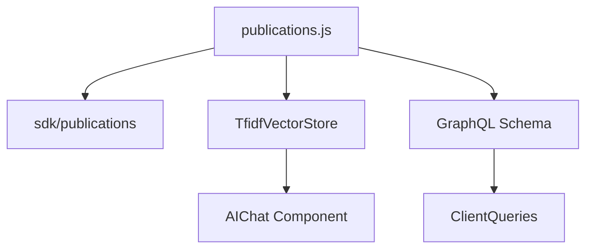
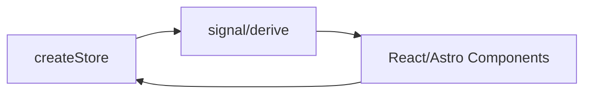
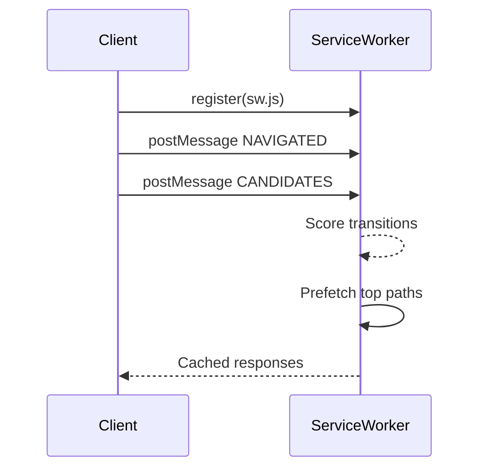
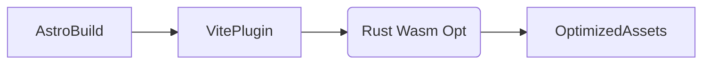

# Portfolio Architecture

## Micro-Frontend & Plugin Flow
```mermaid
flowchart LR
  A[Layout.astro] --> B(initPlugins)
  B --> C{import.meta.glob}
  C -->|*.plugin.ts| D[definePlugin]
  D --> E[registerPlugin]
  E --> F[Registry State]
  F --> G[getComponents(slot)]
  G --> H[Dynamic Render]
```

## Data & AI Layer


## State & Reactivity


## Performance & Prefetch


## Future Rust Bridge (Planned)


## Rationale Summary
- import.meta.glob for zero-config discovery
- Lightweight TF-IDF avoids external embedding dependency initially
- Plugin registry keeps cross-cutting features decoupled
- Service worker prefetch guided by simple frequency heuristic (can evolve to Markov chain)
- Type-level safety via branded types & generics reduces runtime checks needed

## Next Enhancements
1. Replace TF-IDF with WASM-based approximate nearest neighbor index
2. Streaming SSR with partial hydration (islands scheduling)
3. Advanced predictive model using navigation bigrams persisted to IndexedDB
4. Rust-based image analysis & critical CSS extraction
5. Unified CLI to run all codegen steps
